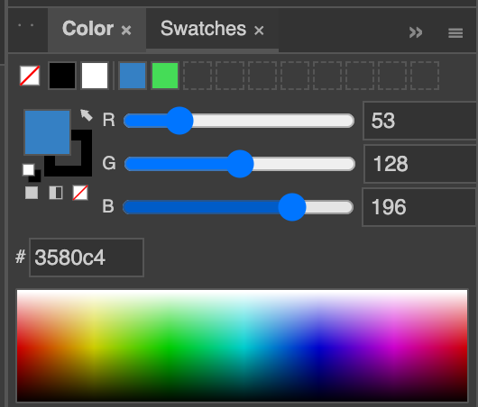
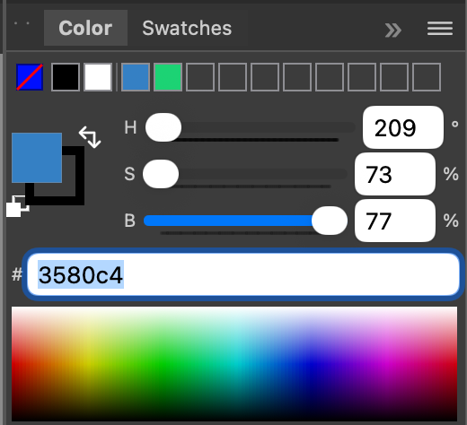
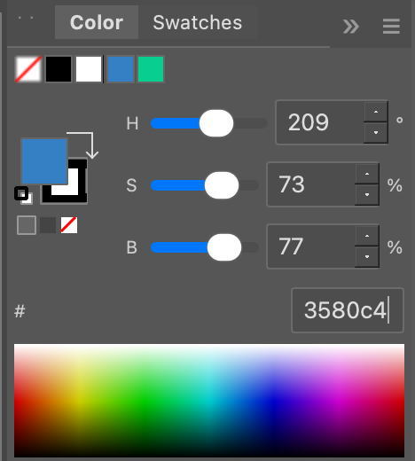
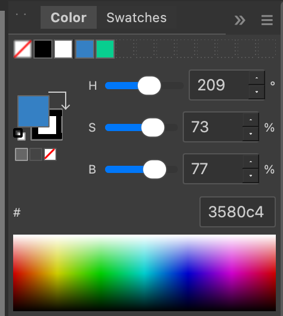
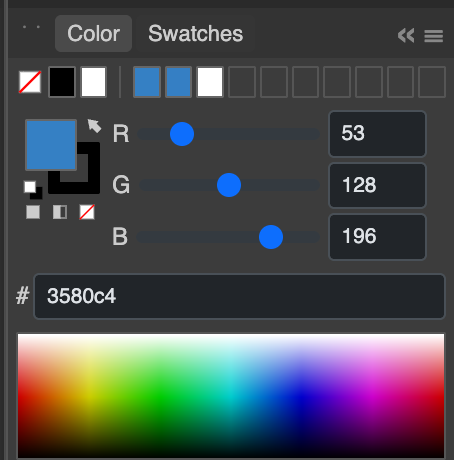

# Jas — one vector editor, written five times

[](https://arxiv.org/abs/2606.07828)
[](https://jyh.github.io/jas/)

### ✨ [**Try it on the web → jyh.github.io/jas**](https://jyh.github.io/jas/)

No install — the full editor (the Rust/Dioxus port compiled to WebAssembly)
runs entirely in your browser. ~2 MB download, no server, nothing tracked.

Jas is a small, inspectable vector-illustration editor (shapes, a full Pen/Pencil path suite, native in-place text, SVG round-tripping) built as **four parallel, behaviourally-identical native implementations** — Rust, Swift, OCaml, and Python — plus a thin Flask web reference renderer, all driven from one shared executable YAML specification. Cross-language differential testing against the shared spec is how correctness is enforced, rather than trusting any single implementation. As of the `five-port-parity` tag (2026-07-22), active development continues in the **Rust and Swift** ports; the OCaml and Python-Qt ports are preserved at that tag as the N-version study concluded, verified by tag-pinned CI canaries (see `POLICY.md` §1). New features land in Rust, get tuned, then propagate to Swift with matching tests.

This repository is the artifact for the paper **"Five Implementations, One Spec: AI-Paired Engineering as a Revival of N-Version Programming"** (Jason Hickey) — [read it on arXiv](https://arxiv.org/abs/2606.07828). The founding vision lives in [`transcripts/AI.md`](transcripts/AI.md) and per-feature prompt transcripts in [`transcripts/`](transcripts/). Status: actively maintained, Apache-2.0.

## The five ports, one panel

The same color panel, rendered by each implementation from the shared spec — visual parity is the point:

| Rust (Dioxus) | Swift (AppKit) | Python (Qt) | OCaml (GTK) | Flask (web ref.) |
|:---:|:---:|:---:|:---:|:---:|
|  |  |  |  |  |

Jas is a vector graphics editor — a small, inspectable vector illustration
application — built as **four parallel, behaviourally-identical native
implementations** of the same application, one per language, each tracking
the same architecture, the same document model, the same tool set, and the
same tests. A fifth implementation, **Flask** (`jas_flask/`), is a thin,
non-gating web reference renderer of the shared YAML/JSON artifacts — it is
*not* a source of truth and *not* an interactive-parity target (see
`TESTING_STRATEGY.md` §6), so it is excluded from the "behave identically"
guarantees below.

| Implementation | UI framework           | Directory      | Status | How to run                |
|----------------|------------------------|----------------|--------|---------------------------|
| Rust           | Dioxus (HTML5 canvas)  | [`jas_dioxus/`](jas_dioxus/) | **active** | `cd jas_dioxus && dx serve`   |
| Swift          | AppKit                 | [`JasSwift/`](JasSwift/)     | **active** | `cd JasSwift && swift run`    |
| Python         | Qt / PySide6           | [`jas/`](jas/)               | frozen at `five-port-parity` | `cd jas && python jas_app.py` |
| OCaml          | GTK 3 / lablgtk3       | [`jas_ocaml/`](jas_ocaml/)   | frozen at `five-port-parity` | `cd jas_ocaml && ./run.sh`    |
| Flask (ref.)   | Flask + JS (web)       | [`jas_flask/`](jas_flask/)   | reference renderer | `cd jas_flask && flask run`   |

The four native apps behave identically as of the `five-port-parity` tag:
the same SVG round-trips through all of them, the same in-canvas text editor
reacts to the same key events, the same selection tool picks the same
elements from the same marquee. The N-version study those four ports served
is complete (see the paper); ongoing development continues in Rust and
Swift, with the frozen ports preserved exactly as tagged and verified by
tag-pinned CI canaries (`POLICY.md` §1). New features land in Rust first,
get tuned, and are then propagated to Swift with matching tests. Because of
this, *Rust is the most complete application*.

## Why four copies?

Building the same program four ways was a deliberate design
constraint, not a historical accident. It enforces:

- **A small, portable architecture** — anything that would be easy in
  one language and awkward in the others tends to get removed, so the
  design converges on ideas that work everywhere.
- **Framework-independent logic** — the model, document, geometry,
  text layout, and tool state machines are all pure code, testable
  without a window or a running event loop.
- **Framework-specific edges** — rendering, cursor overrides, file
  dialogs, and the toolbar bitmaps live in each app's canvas module,
  and nowhere else.
- **Cross-language equivalence as a test** — when something diverges
  (kerning, UTF-8 handling, SVG y-convention), the bug is visible
  because only one port exhibits it.

## What it does

Jas is a single-window editor for SVG-shaped documents. It currently
supports:

- **Shapes** — Rectangle, Rounded Rectangle, Ellipse, Line, Polygon,
  and Star primitives, each draggable into place.
- **Paths** — a full Pen tool with smooth/corner/cusp anchor points;
  Add/Delete/Anchor-Point editors; a freehand Pencil tool with Bezier
  curve fitting; a Path Eraser that splits curves while preserving
  their shape; and a Smooth tool that regularizes anchor points along
  a drag.
- **Text and Type on a Path** — a fully native in-place text editor
  with word-wrap, soft-wrap navigation, per-character hit-testing,
  undo/redo (collapsed to a single document snapshot per session), a
  blinking caret, selection highlighting, multi-line area text, and a
  Type-on-Path variant where glyphs flow along a curve with an
  interactive start-offset handle.
- **Selection** — three modes (Selection, Partial Selection, Interior
  Selection) covering element selection, control-point selection, and
  group-traversal selection, with marquee, shift-extend, alt-copy,
  keyboard nudge, and hit-testing against filled, stroked, and curved
  shapes.
- **Document model** — immutable `Document` with nested layers and
  groups, an observable `Model` with an undo/redo stack, and a
  `Controller` for every mutation operation. Documents are never
  mutated; every edit produces a new `Document`.
- **SVG I/O** — each app can export its current document to SVG and
  reopen SVGs it wrote. Text y-coordinates are converted between the
  SVG baseline and the layout-box top so files round-trip stably.
- **Menu and keyboard** — a standard menu bar plus keyboard
  shortcuts for tools and common edit commands.

## Design

All four ports share one set of design documents, kept deliberately
short:

- [ARCH.md](ARCH.md) — MVC architecture, Model/Controller/Canvas
  boundaries, the `CanvasTool` interface, and the directory layout
  every port mirrors.
- [DOCUMENT.md](DOCUMENT.md) — the immutable `Document`, layers,
  element types, path commands, bounds, and control-point conventions.
- [SELECTION.md](SELECTION.md) — selection state, the three modes, hit
  testing, marquee intersection, and selection operations.
- [TOOLS.md](TOOLS.md) — the toolbar, shared constants, and each of
  the tools (state machines, overlays, keyboard handling).
- [WORKSPACE.md](WORKSPACE.md) — the workspace layout system: pane
  positioning, dock panels, snap constraints, the working-copy save
  pattern, and persistence across all four implementations.
- [MENU.md](MENU.md) — the menu bar structure, commands, and the
  keyboard shortcuts they expose.
- [KEYBOARD_SHORTCUTS.md](KEYBOARD_SHORTCUTS.md) — the target
  shortcut set used as a reference.
- [REQUIREMENTS.md](REQUIREMENTS.md) — the high-level product
  requirements the project started from.
- [`transcripts/`](transcripts/) — the original per-feature prompts used
  to bootstrap each feature.

## Project structure

Each implementation mirrors the same module layout. Names differ
slightly per language but the split is identical:

| Directory         | Contents                                                                                     |
|-------------------|----------------------------------------------------------------------------------------------|
| `geometry/`       | Element types, `PathCommand`, bounds, control-point positions, SVG import/export, unit conversion, text layout (word-wrap, UTF-8, glyph index), path-text layout (arc-length glyph placement), curve fitting |
| `document/`       | Immutable `Document`, observable `Model` with undo/redo, `Controller` with all mutation operations |
| `tools/`          | `CanvasTool` interface, `ToolContext` facade, shared constants, toolbar, and every tool implementation (selection tools, drawing tools, Pen, Pencil, Path Eraser, Smooth, Anchor Point editors, Type, Type on a Path, plus the shared `text_edit` session and `text_measure` helper) |
| `workspace/`      | Workspace layout: pane positions and snap constraints, dock/panel management, persistence, and the working-copy save pattern |
| `canvas/`         | Rendering via the platform 2D API, hit-testing, cursor management, and event dispatch to the active tool |
| `panels/`         | Dock-panel bodies and panel-specific glue over the shared YAML panel interpreter             |
| `algorithms/`     | Path/geometry algorithms (booleans, offset, simplify, brush outlines, planar map) pinned by the cross-language corpus |
| `interpreter/`    | The YAML workspace/expression interpreter (the Python app consumes the shared `workspace_interpreter/` directly instead of an in-app copy) |
| `menu/`           | The application menu bar and its command table                                              |
| `assets/icons/`   | Shared PNG/SVG cursors and toolbar icons used by all four apps                               |

## Running

### Python (Qt)

```bash
cd jas
python jas_app.py
```

Requires PySide6 (see `requirements.txt`).

### OCaml (GTK)

```bash
cd jas_ocaml
./run.sh       # wraps `dune exec bin/main.exe`
```

Requires a recent OCaml with `lablgtk3`, `cairo2`, `xmlm`, and `str`
(see `dune-project`).

### Rust (Dioxus, browser)

```bash
cd jas_dioxus
dx serve       # opens the app in a browser via WebAssembly
```

Requires the Dioxus CLI (`dx`) and a recent Rust toolchain.

### Swift (AppKit)

```bash
cd JasSwift
swift run
```

Requires macOS and a recent Swift toolchain.

## Tests

Each port has its own test runner. On every change to shared logic the
blocking suites are Rust, Swift, and the `workspace_interpreter/`
reference; the frozen OCaml and Python-Qt suites run as CI canaries
against the `five-port-parity` tag (`POLICY.md` §1).

```bash
# Python
cd jas && PYTHONPATH=. python -m pytest

# OCaml
cd jas_ocaml && dune runtest

# Rust
cd jas_dioxus && cargo test

# Swift
cd JasSwift && swift test
```

Rust and Swift counts continue to grow; the Python and OCaml suites are
pinned green at the `five-port-parity` tag. Tests are organized by
module and run without any GUI dependency — they exercise the pure
model, geometry, text layout, SVG, and tool state machines directly,
so they run in milliseconds.

## License

Apache License 2.0. See [LICENSE](LICENSE).
