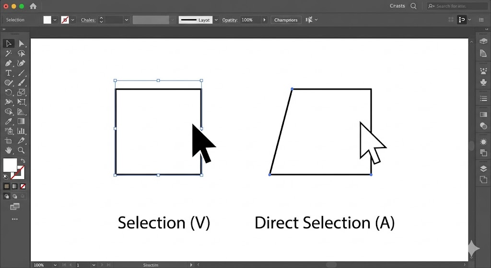
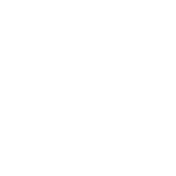
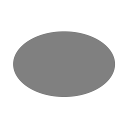
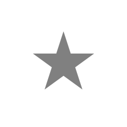

# Jas prompts

This document lists the prompts that were used to construct the vector application. 

Claude, do not modify this file.

# Overall

## Requirements

Read the attached documents. Describe the requirements for an application like Adobe Illustrator. Give extensive detail. There should be enough detail to be able to reimplement an application like Illustrator solely from your requirements without any other instructions. Be specific, and be sure to cover everything.

* Describe the parts of the UI like windows, toolbars, menus, etc.  
* Describe keyboard shortcuts.  
* Describe the important concepts, like objects, paths, layers, artboards, selections, masks, etc.  
* Describe the objectives of the creative professional.

## Response

The software must be built as a vector-based environment where all visual elements are defined by mathematical paths rather than pixels. This architecture ensures "resolution independence," allowing designs to scale from business cards to billboards without loss of quality .

### **Objectives of the Creative Professional**

The primary goal of the professional user is to move a design from initial concept to completion, often involving peer collaboration and client feedback. Key objectives include:

* **Workflow Efficiency:** Utilizing keyboard shortcuts and customized workspaces to accelerate repetitive tasks.  
* **Organization:** Maintaining logical structures through layers, groups, and artboards to manage complex illustrations efficiently .  
* **Precision:** Using grids, guides, and snapping tools to ensure mathematical exactness in layouts .  
* **Professional Output:** Delivering high-quality content in various formats suitable for mobile, web, print, film, and video .

---

### **User Interface Architecture**

The GUI must be highly customizable, allowing users to reconfigure it for specific tasks or comfort .

#### **1\. Primary Windows and Navigation**

* **Home Screen:** Upon launch, users are greeted with a welcome screen to create new files, open recent ones, or access tutorials.  
* **New Document Dialog:** Allows users to choose presets based on intended output (Print, Web, Mobile, Film & Video, Art & Illustration) or use templates .  
* **Application Bar:** Located at the top right, providing access to the Workspace menu and document sharing options.  
* **Workspaces:** Predefined or custom layouts of panels. Standard workspaces include Essentials (default), Layout, Typography, Painting, and Web .

#### **2\. Toolbars and Panels**

* **Main Toolbar:** Usually located on the left; contains tools for selection, drawing, and transformation.  
* **The Dock:** A vertical arrangement on the right where panels and panel groups are collected.  
* **Properties Panel:** A context-sensitive "one-stop shop" that changes based on what is selected, offering quick access to Transforms, Appearance, Alignments, and Quick Actions .  
* **Control Panel:** Located below the application bar, it offers extensive visuals and choices for object attributes like Fill, Stroke, and alignment .  
* **Appearance Panel:** Tracks all attributes (fills, strokes, opacity, blending modes) and effects applied to a selected object .

---

### **Core Functional Concepts**

#### **1\. Structural Elements**

* **Artboards:** The "pages" of the document. A single file can host multiple artboards of different sizes and orientations (Portrait or Landscape).  
  * **Video Safe Areas:** Optional green guides for video content creation, including Title Safe and Action Safe areas .  
* **Layers:** A hierarchy used to separate design parts, functioning like a stack of transparent sheets.  
  * **Template Layers:** Locked and dimmed layers (often 50% opacity by default) used for tracing over sketches or raster images .  
* **Groups:** Binding two or more objects together to move or scale as one unit.  
  * **Sublayers/Nested Groups:** Creating groups within groups to manage details of a larger object.  
* **Isolation Mode:** A view that dims everything else to allow for the editing of a specific group or sublayer without interference.

#### **2\. Path Anatomy and Objects**

* **Anchor Points:** The "dots" defining where a line starts, stops, or turns.  
* **Segments:** The lines or curves connecting anchor points.  
* **Handles (Direction Lines):** "Pull tabs" on anchor points used to adjust the angle and depth of curved segments.  
* **Open vs. Closed Paths:** Open paths are lines (e.g., "U"), while closed paths form complete shapes (e.g., "O").

#### **3\. Appearance and Styling**

* **Fill:** The color, gradient, or pattern inside a closed path.  
* **Stroke:** The outline or border. Attributes include weight (thickness), alignment (Center, Inside, Outside), and variable width profiles.  
* **Blending Modes and Opacity:** Control how an object’s color interacts with objects underneath (e.g., Multiply, Screen) and its level of transparency.

---

### **Functional Tools and Operations**

#### **1\. Essential Drawing Tools**

* **Pen Tool (P):** Creates paths with straight or curved segments with maximum flexibility .  
* **Curvature Tool (Shift \+ \~):** A more intuitive path-creation tool that allows users to preview and edit smooth curves as they draw.  
* **Pencil Tool (N):** Draws freehand vector paths that can be redrawn or smoothed using the Smooth Tool.  
* **Paintbrush (B) & Blob Brush (Shift \+ B):** The Paintbrush applies stylistic brush profiles to a path, while the Blob Brush creates a filled vector shape around the painted area.  
* **Shape Tools:** Standard tools for Rectangles, Ellipses, Polygons, and Stars .

#### **2\. Path Operations and Manipulation**

* **Pathfinder:** A panel for combining, subtracting, or intersecting multiple shapes. Specific modes include Unite, Minus Front, Intersect, Exclude, and Divide .  
* **Shape Builder Tool (Shift \+ M):** Allows users to merge or subtract overlapping areas by simply drawing a line across them .  
* **Clipping Masks:** Using one shape (the mask) to hide parts of underlying objects.  
* **Compound Paths (Ctrl \+ 8):** Combining objects so that overlapping areas create holes (e.g., a donut shape).

#### **3\. Transformations**

Objects can be manipulated via the Transform menu or bounding box handles.

* **Move:** Precise measurement of movement.  
* **Rotate:** Tilting an object to a specific angle.  
* **Reflect:** Mirroring an object horizontally or vertically.  
* **Scale:** Adjusting size while optionally scaling strokes and effects.  
* **Shear:** Sliding selected objects at a chosen angle.

---

### **Typography and Asset Management**

* **Type Tools:** Support for Point Type (headlines), Area Type (paragraph containers), and Type on a Path.  
* **Character and Paragraph Panels:** Deep control over fonts, styles, kerning, tracking, leading, and justification .  
* **Symbols:** Reusable design elements. **Dynamic Symbols** allow editing a master symbol to update all instances or adjusting individual instances independently.  
* **Asset Export:** A panel dedicated to saving independent elements or entire artboards for use in other projects or platforms.

# Steps

Let’s define the elements that make up a document. Each of these elements will be immutable. For python, we define an abstract class Element. Do the same for swift. For OCaml we will use a variant type Element. Elements should conform to the svg specification.

The element coordinates can be specified in any of the following units. The canvas bounding box is in px.  
Unit	Description	Type  
px	Pixels (Default)	Relative to viewing device  
pt	Points (1/72 of an inch)	Absolute (this is the common internal unit)  
pc	Picas (12 points)	Absolute  
in	Inches	Absolute  
cm / mm	Centimeters / Millimeters	Absolute  
em / rem	Font-relative units	Relative to the defined text size

# Lines

let's implement the drawing tool, for a straight line segment. You can see it highlighted in the toolbar image. When this tool is selected, we draw a line on the canvas by clicking the start of the line, dragging, and where we release is the end of the line. During the drag, a light dashed line connects the start point to the mouse cursor.

# Rectangles

Now let’s add support for rectangles. You can see the tool highlighted in the image. When this tool is selected, we draw a rectangle on the canvas by clicking a corner of the rectangle, dragging, and where we release is the other corner of the rectangle. During the drag, a light dashed rectangle connects the start point to the mouse cursor.

# Document

A document should always have at least one layer.

A document has a selected layer.

# Selection

Let’s add support for selections. A selection is a set of elements in the document. Update the document to contain a selection. We are going to want to update these elements in the document (to produce a new document), so pick a good index structure.

When the selection tool is active in the toolbar, and we click the mouse on an element, the element becomes selected. If the element is in a Group (a proper Group, not a Layer), all the elements in the Group are selected. Add a method to the controller to set the selection.

When an element is selected, the control points (the endpoints for a line, or the corners for a rectangle) are highlighted with a small blue square, and the element path is highlighted with a thin bright blue line. The image shows an example.  
![][image1]

When the selection tool is active in the toolbar, and the mouse drags out a box, every element in the box is selected, replacing any previous selection. During the drag, a light dashed displays the selection box.

When selecting, we should consider only the visible drawn part of the element, not the element’s entire bounding box.

### Control points

Every element has control points (the points at the end of a line segment, or the corners in a rectangle). These control points can be individually selected. When a control point is selected, the selection blue square should be filled blue. If not selected, the square should be filled white. To do this, let’s extend each element selection to contain a path, a flag indicating whether the object itself is selection, and a list of control points that are selected.

### Direct selection

The direct selection tool differs from the select tool. When the direct selection tool is used, a mouse click selects only the item directly under the cursor. This can be an object, or one of its control points. A direct selection marquee selects only the elements and control points in the marquee. Groups are ignored. The elements within the group can be individually selected. 

### Group Selection

Add a group selection tool to the toolbar in the same position as the direct selection tool. The tool is shown in the image. A long press on this tool brings up an option to choose between group selection or direct selection.

A group selection behaves like a selection in that it selects entire elements, including their control points. However, it ignores groups. The elements inside a group can be individually selected.

### Toggle selection

If the shift key is pressed while a selection is made (either with a click or with a marquee), then the new selection is toggled: it is added to the current selection if not already selected, otherwise it is already selected, then it is removed from the current selection.

### Move selection

remove the flag in the element selection that indicates whether the element itself is selected. The element itself is always selected.

When the mouse is clicked and dragged on a selection, move all of the control points in the selection. For each element with CP that are being moved, trace the element as it is moved, similar to the way the selection is highlighted.

# Polygon

Let’s add support for polygons. You can see the tool highlighted in the image. Add the tool in the same position as the rectangle tool. When the tool is selected, we draw a regular polygon on the canvas by dragging. The initial drag point is one vertex of the polygon, and the release point is another vertex. The number of sides in the polygon is a configuration parameter. For now, set it in a variable initialized to 5\.

# Constrained dragging

when dragging and the shift key is pressed, constrain the mouse movement to be horizontal, vertical, or at a 45 degree angle

# Copy

When moving a selection, if the option key is pressed when the drag is released, copy all of the elements affected. Keep the copies in their respective layers, adjacent to the original elements. Leave the original elements unaffected.

# Files

In a svg module, implement conversion of a document to svg format. Remember that internal coordinates are in points, but svg coordinates are in px.

In the svg module, we will implement conversion of svg to a document. For each language, discuss with me how you plan to do it.

# Edit Menu

Add a Copy command to the Edit menu. When a selection is copied, convert it to svg and add it to the system clipboard.

Add a Paste command to the Edit menu. When a paste occurs, get the value from the system clipboard. If the value is text, add a text value to the document. If the value is svg, convert it to a document and merge it with the current document in the canvas. Keep the elements in the same layers and preserve grouping. For the Paste command, move the elements by 24pt down and to the right before merging. Also add a “Paste in Place” command to the edit menu, that does the same thing but without the translation.

Add a Cut command to the Edit menu. It is the same as Copy, but deletes the original selection.

When the delete key is pressed, delete the selection.

# Text

Let’s add support for text. You can see the tool highlighted in the image. When this tool is selected, when the mouse is clicked it adds a text element containing the text “Lorum Ipsum”.

When the text tool is selected, when the mouse is clicked on a text element, the text can be edited in place.

When the text tool is selected, and the user drags out a marquee with the mouse, it defines a text area. Text that is added to this area will wrap within the area described by the marquee.

## Pen tool

Let’s develop the pen tool. First let’s add the toolbar element.  You can see the tool highlighted in the image.

Consider the attached file BezierShape.swift.

In this code, a BezierCurve is  made up of a sequence of BezierElement. Each element is a cubic bezier curve. Each element has two endpoints, and each endpoint has a control handle, so each element is described by 4 points. Read the wikipedia article on bezier curves [https://en.wikipedia.org/wiki/B%C3%A9zier\_curve](https://en.wikipedia.org/wiki/B%C3%A9zier_curve) to understand how this works. Do you understand the BezierCurve concept? We will call it a Bezier path.

A Bezier path is a sequence of cubic Bezier segments. It has a start point, an end point, and the points that join segments. These are the control points. It can be open or closed. If the path is closed, and the endpoint is not the same as the start point, otherwise  there is an implicit straight segment from the endpoint to the start point. Each interior control point can be smooth or sharp. If smooth, the control handles and control point lie upon a line. If sharp, the control handles and the control point are not related, they don’t have to lie upon a line. If the path is closed, then then the start point can be smooth or sharp in the same way. Here is an example of a smooth control point. The control handles and control point all form a line.

Here is an example of a sharp control point. The control handles and control point do not form a line.

In svg, Bézier paths are defined within the `d` (data) attribute of a `<path>` element. Cubic Bézier Curves use “C” syntax, like this,  
**Syntax:** `C x1 y1, x2 y2, x y`  
**Structure:**

* **Start Point:** The current pen position.  
* **Control Point 1 (`x1, y1`):** Determines the curve's direction leaving the start.  
* **Control Point 2 (`x2, y2`):** Determines the direction entering the end.  
* **End Point (`x, y`):** Where the curve finishes.

For the pen tool, each mouse click will define a control point. If the mouse is not dragged at a control point,, it is a sharp control point, and the control handles are identical to the control point. If the mouse is dragged, it defines one control handle, with the opposite control handle equidistant from the endpoint, all in a line. Display the control handles like in this smooth image.

if the final mouse endpoint coincides with the start point, this is a closed

When a single CP is selected, display the control handles if there are any. Allow dragging the control handles to alter the path.

by default control points are smooth in a line

For smooth control points, the distance of each control handle from the CP is independent when dragging. We can move our handle in or out and it does not affect the radius of the other control point.

# Text along a path

Add this tool, in the same position as the text tool.

When the Text Along a Path tool is selected, when a selected path is clicked, add text to that path. Allow it to be edited in place. Allow the reference point to be moved along the path.

# Code organization

How can we encapsulate what we just did to create the pen tool?

\[Extract a Tool protocol and route events through it to let each tool be self-contained\]

for ocaml, what happens if we move the various tools into a tools subdirectory?

 for swift, what happens if we move the various tools into a tools subdirectory?

Good morning, Happy Easter. Let’s organize the code. Consider the following organization and make suggestions.

- Move the element-related code to a “geometry” subdirectory.  
- Move the toolbar and tools into a “tools” subdirectory.  
- Move the document, model, and controller to a “document” subdirectory.  
- Move the canvas to a “canvas” subdirectory.  
- Move the menu into a “menu” directory.

# Undo

Let’s implement undo/redo functionality in the Model.

enable the undo menu item only if there is an undo stack. enable the redo menu item only if it is possible to redo.

# File operations

Move the title from the document to the model, and call it the filename.

Implement “Save As” in the File menu, that saves the document in the canvas to a file. It should bring up a standard dialogue box where the user can specify a filename for a svg file. When saving, convert the current document to svg and save it in the file. This should also update the filename in the model.

title the canvas with the filename. When a model is created, generate a fresh filename with the pattern "Untitled-{index}"

Add a “saved document” field  to the model that refers to the document that was written to the file. When the model is created, the saved document is initialized to the current document. When the document is saved, update the saved document to the current document. If the current document is different from the saved document, we say that the model is “modified”. If the model is “modified”, the canvas should display a “\*” next to the filename in the title bar.

Implement “Open…” in the File menu.

The "Open..." should create a new canvas window. This canvas window can start with a new model that contains the document that was read from the file.

The “New” menu item should create a new canvas window with a new model containing an empty document.

There is a canvas that has focus. The operations in the File menu refer to the canvas that has focus.

The “Save” menu item should save the focused canvas.

Place the canvases into a tabbed container, where each canvas is a tab. The container should span the full app window.

The app should start up without a canvas.

When a canvas window is closed, if the model is modified, bring up a dialogue box to prompt the user whether to save before closing. They have the option to cancel.

When the app is closed, if any model is modified, bring up a dialogue box to prompt the user whether to save before closing. It should give the option to cancel, do not save, save, save all, with the default being save.

When Open a file, if there is already a canvas open for that file, just focus the existing canvas. Do not read the file and open a new canvas. There should always only be one canvas per open file.

Add a Revert item to the File menu. When the focused canvas has a model that is modified, the Revert reloads the contents from the file after an alert prompting the user to confirm that all current modifications will be lost. The Revert item is disabled if the document has never been saved to a file, or if the model is not modified.

# Review

Review the entire codebase and evaluate it for clarity, maintainability, efficiency, complexity, safety, test coverage, pattern consistency, conformity with style conventions, functional equivalence across languages, and anything else of importance. Make suggestions for improvements, ranking them in priority from high to low, and giving each a number. Be ready for a deep dive into any of the suggestions.

### Suggestions

## **Codebase Review**

The codebase is well-architected: immutable documents with path-based addressing, clean MVC separation, and a composable tool protocol replicated across three languages. Below are prioritized suggestions.

### **High Priority**

**1\. `ElementSelection` equality semantics diverge across languages**

In Swift, `ElementSelection` hashes/equals by **path only** (Document.swift:21-26), meaning a `Set<ElementSelection>` silently drops entries with the same path but different `controlPoints`. In Python, `@dataclass(frozen=True)` hashes by **all fields** including `control_points` (document.py:28-31), so a `frozenset` could theoretically hold two entries for the same path with different CPs. In OCaml, `PathMap` is explicitly keyed by path (document.ml:28-33), which is the cleanest model.

The Python behavior is the odd one out and could cause subtle bugs: if you update the CPs for a path, you could end up with two `ElementSelection` entries for the same path in the frozenset. The toggle logic in `_toggle_selection` manually works around this with dict-by-path, but any code that builds a selection by adding entries could hit this. Should align Python to match the path-keyed semantics (custom `__hash__`/`__eq__` on path, or use a dict internally).

**2\. `snapshot()` called unconditionally on every mouse press in selection tools**

In all three languages, `SelectionToolBase.on_press` calls `ctx.snapshot()` on every click — even clicks that result in no document change (e.g., clicking empty space, or clicking an already-selected element). This pollutes the undo stack with redundant entries. A user who clicks 10 times on empty canvas then draws a line needs to hit Undo 11 times. Snapshot should be deferred until a mutation actually occurs.

**3\. Bezier hit-testing uses chord approximation in controller**

`_segments_of_element` for `Path` elements converts curves to straight chords (start→end) rather than using the flattened polyline that exists in `element.py`'s `_flatten_path_commands`. This means marquee selection can miss paths where the curve bows away from its chord. The flattened approximation already exists and is used for text-on-path — reuse it for hit-testing too.

**4\. `_segments_of_element` ignores `ClosePath`**

When a path has a `ClosePath` command, the segment from the current point back to the subpath start is not generated (controller.py:141). This means closed paths have a gap in hit-testing along their closing edge. Same issue in OCaml.

### **Medium Priority**

**5\. No `Equatable` conformance on Python `ElementSelection` for path-only lookup**

`get_element_selection` does a linear scan of the frozenset (document.py:44-49). With the OCaml PathMap or a dict, this is O(log n) or O(1). For typical selection sizes this doesn't matter, but the linear scan pattern is repeated in several places. Consider switching to a dict internally.

**6\. OCaml selection uses `int list` for control points; Python/Swift use `frozenset[int]`/`Set<Int>`**

OCaml's `es_control_points` is a plain `int list` (document.ml:25), which allows duplicates and has O(n) membership checks. The toggle logic in OCaml must be carefully managing this. Should be an `IntSet` for parity.

**7\. Transform not inverse-applied during hit-testing**

All three languages check `_element_intersects_rect` using the element's raw coordinates, ignoring `transform`. An element with a rotate or scale transform will be hit-tested against its untransformed bounds. This is consistent across languages but geometrically incorrect — a rotated rectangle won't be selectable by its visual position.

**8\. `Polyline` filled hit-test uses bounding box, not polygon containment**

controller.py:176-178: filled polylines use `_rects_intersect` on the bounding box, which over-approximates. A filled L-shaped polyline would be selectable by clicking in the concave region. Same in OCaml and Swift.

**9\. `bounds()` doesn't account for stroke width**

All elements compute bounds from geometric coordinates only. A line with `stroke_width: 10` visually extends 5px beyond its endpoints, but `bounds()` returns zero-width for a horizontal line. This affects both rendering (clipping) and selection hit-testing.

**10\. View menu items are placeholders**

Zoom In, Zoom Out, Fit in Window all just `print()` in all three languages. The menu items exist and have keyboard shortcuts but do nothing.

### **Lower Priority**

**11\. `_path_bounds` only uses endpoints, not control points**

element.py:296-298: Bezier curves can extend well beyond their endpoints. The bounds computation should include control points (or better, the tight hull) to avoid clipping during rendering. Same in all three languages.

**12\. OCaml `List.nth` is O(n) for document tree navigation**

`get_element`, `replace_element`, etc. use `List.nth` which is O(n) for each level of the tree. Python uses tuple indexing (O(1)) and Swift uses array indexing (O(1)). For large documents with many layers/children, the OCaml version will be slower. Consider using arrays.

**13\. Undo stack stores full document copies**

Each `snapshot()` clones the entire document (100 deep). For large documents, this is memory-heavy. A command-based undo (storing deltas) would be more efficient, but the current approach is simpler and correct.

**14\. `_ellipse_intersects_rect` scales the rectangle non-uniformly**

controller.py:92-102: dividing `rw` by `erx` and `rh` by `ery` distorts the aspect ratio of the selection rectangle, which can produce incorrect results for highly eccentric ellipses with non-square selection rects. This is a known approximation but worth noting.

**15\. SVG `text-decoration`, `font-weight`, `font-style` not preserved**

SVG import/export handles basic text attributes but drops decorations and weight. Round-tripping an SVG with bold or italic text will lose those attributes.

**16\. `ArcTo` rendering approximated as straight line in canvas**

Path rendering treats `ArcTo` as a line to endpoint in the Python canvas. OCaml has a similar approximation. SVG arcs should be converted to cubic Bezier approximations for correct rendering.

**17\. Test coverage gaps**

* No tests for paste/copy/cut operations  
* No tests for pen tool path construction  
* No tests for text-on-path offset calculation  
* No tests for save/revert file I/O (menu\_test.py only checks menu structure)  
* No tests for `delete_selection` with nested groups

**18\. Naming inconsistency: `TextPath` element type name**

Python uses `TextPath` (a dataclass), OCaml uses `Text_path` (variant), Swift uses `JasTextPath` (struct) wrapped in `.textPath` (enum case). The Jas-prefix in Swift is applied inconsistently — `LineCap`, `LineJoin` don't have it but `JasColor`, `JasFill`, `JasStroke` do. Should be all-prefixed or none.

**19\. Magic numbers scattered across tools**

* `8.0` px hit-test radius (selection, pen close radius)  
* `10.0` handle draw size  
* `24.0` pt paste offset  
* `500` ms long-press timer  
* `4.0` px drag threshold (text tool)  
* `20` segments per curve (path flattening)  
* `5` sides for polygon tool

These could be named constants at the module level for clarity (some already are, like `_PEN_CLOSE_RADIUS`).

**20\. Python `_revert` and `_save` could lose data on I/O error after `snapshot()`**

In the new `_revert` function, `snapshot()` is called before reading the file. If the file read fails, the undo stack now has an extra entry. Minor, but the snapshot should happen only after successful read, right before setting the document.

# Review

Review the entire codebase and evaluate it for clarity, maintainability, efficiency, complexity, safety, test coverage, pattern consistency, conformity with style conventions, functional equivalence across languages, and anything else of importance. Make suggestions for improvements, ranking them in priority from high to low, and giving each a number. Be ready for a deep dive into any of the suggestions.

# Review (again)

Review the entire codebase and evaluate it for clarity, maintainability, efficiency, complexity, safety, test coverage, pattern consistency, conformity with style conventions, functional equivalence across languages, and anything else of importance. Make suggestions for improvements, ranking them in priority from high to low, and giving each a number. Be ready for a deep dive into any of the suggestions.

# Pencil Tool

Let’s add support for the pencil tool. You can see the tool highlighted in the image. When this tool is selected, a freeform curve is created when the mouse is dragged on the canvas. The raw freeform curve is then converted to an open Bezier path. The attached swift file gives an example of an algorithm to perform the conversion.

# Locking

Layers and elements can be locked, which means they cannot be selected. Add a flag to each element that indicates whether it is locked. Add a Lock item to the Object menu, which locks the elements in the selection (and deselects them). Add an “Unlock All” item to the Object menu that unlocks all elements.

After “Unlock All”, the current selection is cleared, and all of the newly unlocked elements are selected.

When a Group is locked, all elements in the Group are locked. When a Group is unlocked, all elements in the Group are unlocked.

# Grouping

Add an Object menu to the right of the Edit menu. Add a Group item to the Object menu. When the Group operation is performed, the selected elements are combined into a Group element. When any element in a group is selected, the group is also selected, and so are all of the other elements in the group.

Add an Ungroup item to the Object menu. This operation unpacks all the selected groups and deletes the now-empty Group elements.

Add an “Ungroup All” item to the Object menu, below the Ungroup item. This operation ungroups all Group elements that are not locked, whether they are selected or not.

# Adding support Rust+Dioxus

Review the entire codebase and understand it. I would love to make another instance of this app in Rust/Leptos. Discuss it with me. Is it possible? What obstacles will we face.

…discussion about Leptos vs. Dioxus vs. iced…

Let’s implement an app in Ruse+Dioxus.

…Makes a plan and we go through it step by step…

Done\!

# Review

Review the entire codebase and evaluate it for clarity, maintainability, efficiency, complexity, safety, test coverage, pattern consistency, conformity with style conventions, functional equivalence across languages, and anything else of importance. Make suggestions for improvements, ranking them in priority from high to low, and giving each a number. Be ready for a deep dive into any of the suggestions.

…

# Fixes

For all apps. If any tool is clicked while creating a path, the input is concluded, and the path is created. Even the same tool.

For all apps. When an element is created, the previous selection is cleared, and all of its CP become selected.

for the rust app, the tool should be immediately highlighted when it becomes active.

# Appearance

For all apps, we want to update the mouse cursor to reflect the tool that is active. Let's take it in steps. First, let's change the mouse cursor so that it looks like a reticle, at all times. We just want to ensure that we can set the mouse cursor at this point.

## Selection

Ok, now that we can change the mouse cursor, let's use it to reflect the tool that is active.  Let's take it in steps. First, let's change the cursor for the selection tools.

The attached image describes the cursors for the selection and direct selection tools. When these tools are active, set the mouse cursor to correspond.

The attached image describes the cursor for the group selection tool. It is like the direct selection tool, but it has a + to the right of the arrow. Let's use this for the mouse cursor.

Now let's update the images in the toolbar, for all apps. The attached images show the selection, direct selection, and group selection.

## Pen tools

The attached image shows an image of the pen tool. The cursor point is at the tip of the pen. Update the mouse cursor as described when the pen tool is active. When the pen tool is active, use this for the mouse cursor. Also use it for the icon in the toolbar. Use the file: assets/icons/pen tool.svg

There are three types of anchor points (control points) on a path. "Smooth points" are used for creating fluid, continuous curves; the control handles and the control point all form a line. "Corner points" are sharp, and have no handles at all (i.e. the handle length is 0). "Cusp points" have handles that are independent of one another, not locked in a straight line.

Let's add the Add Anchor Point tool to the toolbar in all apps. When the Add Anchor Point tool is clicked on a path, it adds a new control point at that location in the path. The new control point should be a smooth point, and it should preserve the shape of the path. Add this tool in the same slot as the pen tool. The cursor image is just like the pen tool, but with a plus sign to the right near the base. The svg file is in the file "assets/icons/add anchor point.svg", and the png file is in the file "assets/icons/add anchor point.png". Add it in the same way as the pen tool.

Add it to the rust app first, so we can see how it works. Once we're satisfied, we can propagate to the other apps.

If the Add Anchor Point is clicked and dragged on a path, it adds a control point and allows the smooth control handles to be moved.

If the Option key is down while dragging a handle, it breaks the connection with the other handle, allowing you to change the direction of the next curve without moving the previous one. If the Option key is down when clicking an anchor, it converts a smooth point to a corner point (or vice versa).

for cusp points, each control handle should be visualized as connected with the control point

While holding down the mouse button to place a point with the Add Anchor Point tool, hold Space to reposition that anchor point before you commit to its placement.

Let's add the Delete Anchor Point tool to the toolbar in all apps. When the Delete Anchor Point tool is clicked on a control point, the control point is deleted.  The cursor image is just like the pen tool, but with a minus sign to the right near the base. The svg file is in the file "assets/icons/delete anchor point.svg", and the png file is in the file "assets/icons/delete anchor point.png". Add it in the same way as the pen tool. Let's do it in rust first to see how it works. Once we're satisfied we can propagate to the other apps.

When an anchor point is deleted, the desired behavior is to select all the remaining CP.

Let's add the Anchor Point tool to the toolbar in all apps. If the Anchor Point tool is dragged on a corner point, it converts smooth point, pulling out control handles. If the Anchor Point tool is clicked on a smooth point, it converts it to a corner point. If the Anchor Point tool dragged on a control handle, it breaks the connection with the other handle, creating a cusp point. The cursor image is just like the pen tool, but with a < sign to the right near the base. The svg file is in the file "assets/icons/anchor point.svg", and the png file is in the file "assets/icons/anchor point.png". Add it in the same way as the pen tool. Let's do it in rust first to see how it works. Once we're satisfied we can propagate to the other apps.

## Line tool

Let's update the the toolbar icon for the Line Segment tool. The mouse cursor remains crosshairs. The svg file is in the file "assets/icons/line.svg", and the png file is in the file "assets/icons/line.png". Add it in the same way as the pen tool. Let's do it in rust first to see how it works. Once we're satisfied we can propagate to the other apps.

Now let’s add a Rounded Rectangle tool. When this tool is selected, we draw a rounded rectangle on the canvas by clicking a corner of the rectangle, dragging, and where we release is the other corner of the rectangle, just like a regular rectangle. The tool should go in the same slot as the Rectangle tool. The radius of rounded should be defined as a module parameter, let's initialize it to 10pt. The svg file is in the file "assets/icons/rounded rect.svg", and the png file is in the file "assets/icons/rounded rect.png". Add it in the same way as the Rectangle tool. Let's do it in rust first to see how it works. Once we're satisfied we can propagate to the other apps.

Let's add an Ellipse tool. When this tool is selected, we draw an ellipse on the canvas by clicking a corner of the bounding box of the ellipse, dragging, and where we release is the other corner of the bounding box of the ellipse. The tool should go in the same slot as the Rectangle tool. The svg file is in the file "assets/icons/ellipse.svg", and the png file is in the file "assets/icons/ellipse.png". Add it in the same way as the Rectangle tool. Let's do it in rust first to see how it works. Once we're satisfied we can propagate to the other apps.

Let's add a Star Tool. When this tool is selected, we draw a star on the canvas by dragging out the bounding box. The number of points in the star should be a module parameter, initialize it to 5. The tool should go in the same slot as the Rectangle tool. The svg file is in the file "assets/icons/star.svg", and the png file is in the file "assets/icons/star.png". Add it in the same way as the Rectangle tool. Let's do it in rust first to see how it works. Once we're satisfied we can propagate to the other apps.

# Type tool

Let's work on the Text tool. First, rename the Text Tool to the Type tool. Then update the toolbar icon from the svg file "assets/icons/type.svg" and the png file "assets/icons/type.png". The cursor should be set from "assets/icons/type cursor.svg" and "assets/icons/type cursor.png". Let's do it in rust first to see how it works. Once we're satisfied we can propagate to the other apps.

 

Rename the Text on a Path Tool to the Type on a Path Tool. Then update the toolbar icon from the svg file "assets/icons/type on a path.svg" and the png file "assets/icons/type on a path.png". The cursor should be set from "assets/icons/type on a path cursor.svg" and "assets/icons/type on a path cursor.png" with the cursor point at the crosshairs. Let's do it in rust first to see how it works. Once we're satisfied we can propagate to the other apps.

 

## Type editor

Now, let's change the type editor to edit text natively in place, without any need for text input widgets. Let's do this in rust first to see how it works. Once we're satisfied we can propagate to the other apps.

When a type tool is active, and the mouse hovers over some unlocked text, the mouse cursor changes to a type insertion cursor, with svg asset "assets/icons/type insertion cursor.svg" and png asset "assets/icons/type insertion cursor.png". Clicking on the text selects that text element, begins editing at that point within the text, and switches to a text cursor. Text editing also begins whenever new text is created, with the insertion point at the beginning of the text. The mouse cursor does not display during text editing.

When text is edited, there is an insertion point position within the text. A simple text cursor should be drawn at the insertion point, as a vertical line separating the character before the insertion point and the character after. The text cursor should be aligned with the text so that the two characters are clearly separated, but it should not affect the position of those characters. The text cursor should have the same color attributes as the text being edited. The text cursor should flash. If the mouse is dragged through the text, the region under the drag should be "selected". The insertion point moves to the point before the first character in the text that was selected. Selected text should be highlighted with a color that is in clear contrast to the selected text. Use light blue if possible, but if that does not provide enough contrast with the selected text, choose another color.

When text is inserted, either by typing a key, or by pasting from the clipboard, the text is added after the insertion point. If any text was selected, that text is deleted and replaced by the insertion, and the selection is cleared. The insertion point moves after the text that was inserted. 

Use standard text editing conventions. For example, when the backspace key is pressed, if there is a selection, the selection is deleted. Otherwise, the character before the insertion point is deleted. Arrow keys can be used to move the insertion point, etc.

The text editing session ends when the element selection changes, for example with the ESC key, or by adding or editing a different text area, choosing another tool, etc. Restore the mouse cursor, etc.

Add a new undo/redo mechanism used only during text editing, keeping track of all text insertions, deletions, selections, etc. The state of this mechanism state can be discarded after the edit session is complete.

Before we begin, do you understand these instructions? Do you have any clarifications or suggestions?

# Review

Review the entire codebase and evaluate it for clarity, maintainability, efficiency, complexity, safety, test coverage, pattern consistency, conformity with style conventions, functional equivalence across languages, and anything else of importance. Make suggestions for improvements, ranking them in priority from high to low, and giving each a number. Be ready for a deep dive into any of the suggestions.

# Control points optimization

In a selection, I'm thinking that it might be better to represent the control point sets with bit vectors, rather than lists or sets of integers. This could be a more efficient representation, and also prevent bugs with duplicate integers in a control point set. Consider this idea. What do you think? What suggestions do you have?

...After discussion, we settled on SelectionKind == All | Partial of SortedVec<u16>, since most selections include all control points...

# Visibility

Layers and elements can have 3 visibility mode: preview, outline, or invisible. 
- preview: the element is fully drawn
- outline: the element's stroke and fill are ignored. It is drawn as if it had a stroke of size 0, stroke color black, and no fill. Hit detection does not consider the fill or stroke width. Text is an exception. Text in outline mode is drawn the same as preview.
- invisible: the element is not displayed and it cannot be selected.

These three values are ordered from maximum visibility (preview) to minimum (invisible). The visibility of a Group or Layer caps the visibility of the elements in the group. If the group is invisible, then all of its elements are invisible.

Add a flag to each element that indicates its visiblity state.

Add a Hide item to the Object menu, which sets the visibility of elements in the selection to invisible (and deselects them). Add an “Show All” item to the Object menu that sets the visibility of all hidden elements to preview.

After “Show All”, the current selection is cleared, and all of the newly shown elements are selected.

# Pathfinder

Can we implement boolean operations with Martinez-Rueda-Feito? Give me your suggestions.

[we discuss, then about 60min to implement]

# Refactor

We have various algorithms like fit_curve, hit test, boolean, etc. We may develop more with time. What about factoring these code into a directory called "algorithms"? Give me you suggestions.

[we do this before porting the boolean operations]

# Boolean operations

let's go back to the boolean implementation in rust. do we have any roundtrip tests, for example where we subtract an element, then union it back in, then check that the result is the same as the original?

maybe we should add commutative tests

let's also add associativity

> [found a bug in subtract]

Build a minimal reproducer

> [got one with 2 squares]

fix it

> [think for 20 min]

> Found it. Look at event [0]:
> 
> [0] Subject (0.0, 0.0)→(5.0, 0.0) type=NonContributing in_out=false other_in_out=true in_result=false
> The first half of a's bottom edge is marked NonContributing when it should be Normal. Its other_in_out=true is correct (outside b), so if edge_type were Normal it would be in the result. The > handle_collinear function is marking the wrong event as NonContributing.
>
> The fix
> 
> Make divide_segment return (l_idx, nr_idx) so callers can refer to the new events directly. Then fix the 3 buggy sites.

what happens when we perform a boolean operation like union on two rings that are very very close, but not exactly equal?

> Want me to write a few "fuzz" tests that systematically perturb the minimal repro fixture by decreasing amounts (1e-15, 1e-12, 1e-10, 1e-8, 1e-6) and report what each produces? 

yes

> Empirical results are significantly worse than I predicted. 

I also want to support self-intersection. Does that affect our choices?

> Yes, substantially.

This is from user-drawn input. We should probably use non-zero winding. yes, we need to preserve the self-intersections. we will want to port to the other 3 languages.

> Do you want semantic (A) or structural (B) preservation?

Reading B probably makes more sense, but let's discuss first. We will be mapping document elements to rings, performing a boolean operation, then mapping back to document elements. We want the final geometry to be intuitively sensible to the artist.

> Let me push back a little, because I think "preserve self-intersections" and "intuitive to the artist" are actually in tension in most of the cases you care about, and the right call might not be Reading B. ....

that's a very good explanation, I agree, let's go with reading A

> Before implementing, I want to enumerate test cases so I can write them first (TDD-style) and not miss anything:

go

> adds normalization and fixes tests

> Before we talk ports I want to flag something. We still have the off-line-split bug in handle_collinear Case D2 as a latent issue. 

fix it

> [In the end, we left in a bug that occurs only when the entire selection fits into a 1-unit square, so in practice it never occurs. We decided to do nothing about it.]

# Review

Review the entire codebase and evaluate it for clarity, maintainability, efficiency, complexity, safety, test coverage, pattern consistency, conformity with style conventions, functional equivalence across languages, and anything else of importance. Make suggestions for improvements, ranking them in priority from high to low, and giving each a number. Be ready for a deep dive into any of the suggestions.

# Shape Builder tool
 
Next' let's develop an algorithm for Planar Graph Extraction. For this, we treat a set of elements as a collection of fragments created by every overlapping path. The idea is to take all path and split them at intersection points. After this,. we have a collection of individual edges that meet at nodes. A "face" can be defined by the left-at-intersection rule: start at an edge, and at every node, always take the leftmost available path. If this path forms a loop, the edged define the boundaries of a shape. Here is an implementation proposal.

The Data Structure: Doubly Connected Edge List (DCEL)

In computational geometry, a DCEL stores: 
Vertices: $(x, y)$ coordinates.
Edges: Links between vertices, but stored as "half-edges" (one for each direction).
Faces: A pointer to one of the edges that bounds the empty space.

The Workflow in Rust
Intersection: Use a Sweep-line algorithm (like Bentley-Ottmann) to find all intersections in $O((n+k) \log n)$ time. This is much faster than checking every line against every other line.
Graph Construction: Build a petgraph (a popular Rust graph crate) or a custom DCEL.
Face Traversal: Traverse the graph to find all enclosed areas.
Hit Testing: When the user clicks, use a Point-in-Polygon test to see which Face index they hit.

What do you think of this plan? Give me your suggestions.

# Shape tool

Let’s write an algorithm that takes a path and converts it to the nearest geometric object, a triangle, square, rectangle, circle, ellipse, figure-8, etc. please give suggestions.

# Lasso tool

Let's implement a lasso tool. This is like the Select Tool, but the selection marquee is drawn freehand. This should go in a new slot in the toolbar. Invent a toolbar icon and mouse cursor. W will replace them later.

# Dock

Let's update the UI. First we define some terms.

- A Dock is a container element that contains a list of Panel Group elements, from top to bottom.
- A Panel Group is a tabbed container of Panel elements.
  When multiple individual panels (like Layers, Color, and Stroke)
  are stacked on top of each other within a single frame, they form
  a Panel Group. The UI element at the top that allows you to switch
  between them is the Tab Bar.
- A Panel is a rectangular window that houses specific tools,
  information, or controls related to a particular task. For example,
  a color panel might contain the colors of the selected element. A
  stroke panel could contain the stroke parameters of the selection.
- Core Functions of a Dock
   - Anchoring: It provides a "snapping" point. When you drag a panel near the edge of the screen, the dock grabs it and locks it into place.
   - Management: It allows you to expand or collapse entire groups of tools at once.
   - Persistent Location: It ensures that every time you open the app, your "Layers" or "Properties" are exactly where you left them.
- Key Characteristics of a Panel
   - Modular: It can often be moved, resized, or grouped with other panels.
   - Persistent: Unlike a pop-up menu that disappears after you click something, a panel stays visible until you manually close or collapse it.
   - Functional Focus: Each panel usually has a singular purpose. For example, the Layers Panel only handles layer stack management; the Color Panel only handles color selection.
   - State-Aware: Panels often update in real-time based on what is selected in the main workspace.
 - Common Types of Panels
   - Floating Panels: These "hover" over the workspace and can be dragged anywhere on the screen.
   - Docked Panels: These are "snapped" into a specific side of the application window (common in IDEs like VS Code or creative suites like Illustrator).
   - Collapsible Panels: These can be shrunk down to just an icon or a title bar to save screen real estate.
   - Contextual Panels: These automatically appear or change their content based on what the user is doing (often called "Properties" panels).

The image in examples/ai.png shows a Dock to the right of the canvas, containing several panel groups, with sever panels, for example Color, Color Guide, Swatches in the
first panel group, Stroke, Gradient, and Transparency in the second group and so forth. To the left of the dock is another dock that has been collapsed.

We want to implement these. Do you understand the concepts? Please give suggestions.

[...]

The panel groups should be draggable so they can be repositioned. They can also be dragged into another dock.
When a panel group is dragged out of a dock, it creates a new floating dock. A panel can be dragged into another 
panel group. When a panel is dragged into empty space, it creates a new floating panel group and dock.
